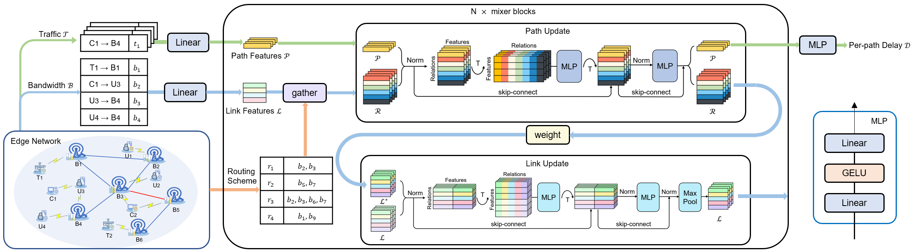

# MixerNet
Code for our CNSM'2022 paper "A Novel Network Delay Prediction Model with Mixed Multi-layer Perceptron Architecture for Edge Computing"


If you find this code useful in your research please cite

```
@INPROCEEDINGS{fang2022a,  
  author={Fang, Honglin and Yu, Peng and Wang, Ying and Li, Wenjing and Zhou, Fanqin and Ma, Run},  
  booktitle={2022 18th International Conference on Network and Service Management (CNSM)},   
  title={A Novel Network Delay Prediction Model with Mixed Multi-layer Perceptron Architecture for Edge Computing},   
  year={2022},  
  volume={},  
  number={},  
  pages={191-197},  
  doi={10.23919/CNSM55787.2022.9964552}
}
```

## Setup


The main environment is (latest is also available):
* cuda 11.3
* torch 1.8.0
* networkx 2.6.3
* einops 0.4.0

### Prepare dataset
NSFNET and GEANT2 datasets are publicly available [here](https://github.com/BNN-UPC/NetworkModelingDatasets/tree/master/datasets_v0)

```
cd dataset
# For NSFNET
wget "http://knowledgedefinednetworking.org/data/datasets_v0/nsfnet.tar.gz"
tar -xvzf nsfnet.tar.gz 
# For GEANT2
wget "http://knowledgedefinednetworking.org/data/datasets_v0/geant2.tar.gz"
tar -xvzf geant2.tar.gz
```

## Train Model
* **Train with data process(first time)**
```
# for NSFNET
python run.py --net nsfnetbw
# for GEANT2
python run.py --net geant2bw
```
* **Train**
```
# for NSFNET
python run.py --net nsfnetbw --process False
# for GEANT2
python run.py --net geant2bw --process False
```

Also other model parameters and training hyper-parameters can be changed by adding argparse like `--lr 3e-4 --dim 64`.

## Related publications:
* RouteNet (JSAC 2020) [paper](https://ieeexplore.ieee.org/document/9109574) [code](https://github.com/knowledgedefinednetworking/demo-routenet)